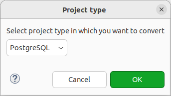

===================
Конвертация проекта
===================

Любой проект можно сконвертировать в проект pgCodeKeeper. Для этого из меню проекта выберите пункт **Configure -> Convert to pgCodeKeeper project.**

.. image:: ../images/convert_project_menu.png

Затем необходимо выбрать тип проекта: PostgreSQL(для PostgreSQL и Greenplum), MS SQL или ClickHouse.

Если структура проекта не соответствует стандарту, будет показано предупреждение.

.. image:: ../images/convert_project_warning.png