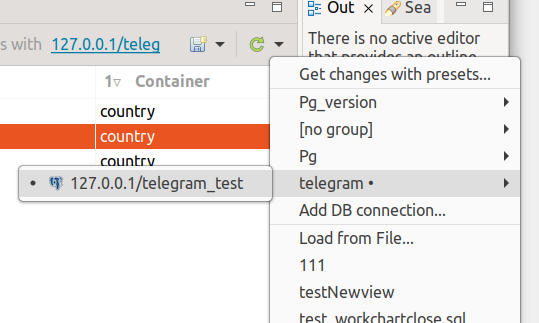
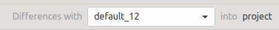
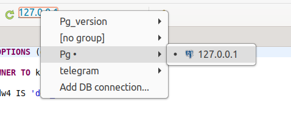

===========================
Выбор источника базы данных
===========================

В редакторе проекта для выбора источника БД используется выпадающее меню **Get Changes / Получить изменения** |refresh|

или выпдающий список.

В редакторе SQL выбор источника БД происходит в выпадающем списке на панели инструментов Eclipse.

В списках источников БД показаны доступные подключения к БД и последние три дамп-файла.

Список баз данных находится в :ref:`dbStore`, в которое можно перейти по пункту **Add DB connection / Добавить подключение к БД** в выпадающем меню кнопки **Get Changes / Получить изменения** |refresh| или комбобокса.

Для выбора файл-дампа необходимо выбрать элемент списка **Load from file... / Загрузить из файла...**. В открывшемся диалоговом окне выбираем нужный нам файл и нажимаем кнопку **OK**. Выбранный файл добавлен в список источников баз данных.

.. |refresh| image:: ../images/pgcodekeeper_project_view/refresh.png