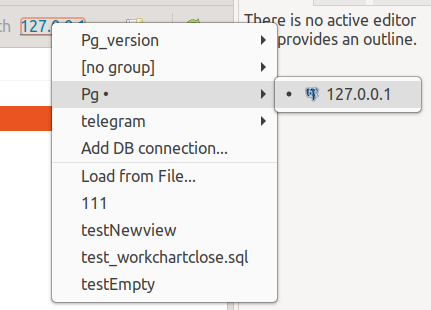

===========================
Выбор источника базы данных
===========================

В редакторе проекта для выбора источника БД используется выпадающее меню **Get Changes / Получить изменения** |refresh|

.. image:: ../images/select_source_db1.png

или в контекстном меню выбранной БД.

В редакторе SQL выбор источника БД происходит в контекстном меню выбранной БД на панели инструментов Eclipse.

В списках источников БД показаны доступные подключения к БД, объединенные по группам, а так же последние использованные дамп-файлы.

Список баз данных находится в :ref:`dbStore`, в которое можно перейти по пункту **Add DB connection / Добавить подключение к БД** в выпадающем меню кнопки **Get Changes / Получить изменения** |refresh| или комбобокса.

Для выбора файл-дампа необходимо выбрать элемент списка **Load from file... / Загрузить из файла...**. В открывшемся диалоговом окне выбираем нужный нам файл и нажимаем кнопку **OK**. Выбранный файл добавлен в список источников баз данных.

.. |refresh| image:: ../images/pgcodekeeper_project_view/refresh.png
   :height: 16px
   :width: 16 px

Группировка источников базы данных
~~~~~~~~~~~~~~~~~~~~~~~~~~~~~~~~~~~

Для объединения баз данных в группы, выберите **DB Store / Хранилище БД** в глобальных настройках pgCodeKeeper и нажмите кнопку **Edit / Редактировать**. В поле **Group / Группа** задайте группу или выберите существующую.

.. image:: ../images/new_connection.png

Хранение паролей
~~~~~~~~~~~~~~~~

При нестабильной работе Eclipse можно отключить хранение паролей в безопасном хранилище Eclipse. В этом случае пароли БД будут храниться открытым текстом в рабочем пространстве Eclipse (workspace). Также, возможно использовать пароли из файла *.pgpass*. Для отключения сохранения паролей в безопасном хранилище Eclipse выключите флажок в настройке **Save password in Eclipse secure storage / Сохранять пароли в безопасном хранилище Eclipse**.

.. image:: ../images/db_store.png