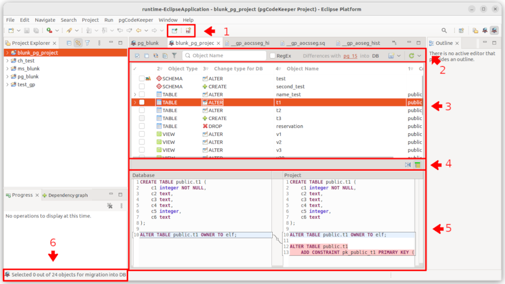
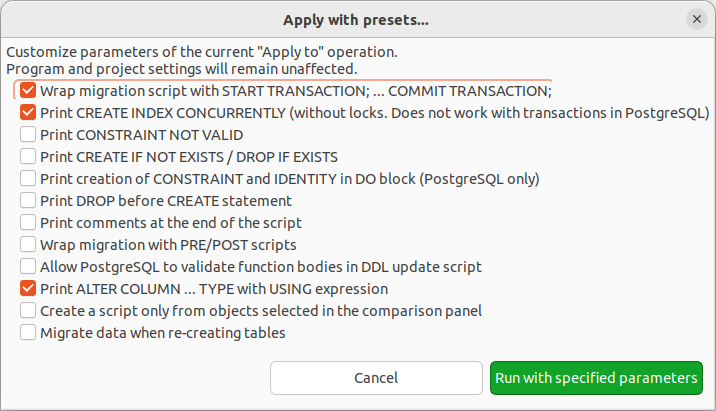

==================
Редакторы и панели
==================

.. _projEditor :

Редактор проекта pgCodeKeeper
~~~~~~~~~~~~~~~~~~~~~~~~~~~~~

Редактор проекта – основной способ работы с pgCodeKeeper. Интерфейс редактора, состоящий из нескольких основных частей:

#. Панель инструментов Eclipse
#. Панель инструментов редактора
#. Таблица различий
#. Панель инструментов cравнения
#. Панель сравнения
#. Счетчик объектов

**Панель инструментов Eclipse** содержит инструменты для работы с редактором SQL. Кнопка |file| позволяет открыть новый :ref:`sqlEditor`.

**Панель инструментов редактора** предназначена для работы со списком объектов. Существуют следующие возможности:

- |check_all| – выбрать все элементы.
- |uncheck_all| – снять выбор со всех элементов.
- |loop_obj| – инвертировать выбор элементов.
- |copy_edit| – копировать набор выбранных элементов в буфер обмена как регулярное выражение.
- |empty_filter| – неактивный / |filter_tsk| – активный фильтр объектов.
- |search| – отфильтровать список объектов по имени или регулярному выражению.
- |save_edit| – применить изменения
- |triangle| – выпадающее меню с направлениями изменений. При клике по лейблу DB/БД также отображается меню с направлениями изменений.
- |refresh| – получить изменения
- |triangle| – выпадающее меню с источниками баз данных. Источники баз данных можно выбрать в контекстном меню выбранной БД |source_name| на панели инструментов редактора (2).

Выпадающие меню |triangle| позволяют запустить операции получения или применения изменений с переопределением некоторых настроек.

Переопределяемые настройки для получения изменений

Переопределяемые настройки для применения изменений

**Таблица различий** отображает список объектов, которые различаются в сравниваемых схемах БД. Здесь доступна информация: тип объекта, тип изменения, имя объекта, контейнер, пользователь git, пользователь базы данных.

Тип объекта - поддерживаются следующие типы объектов:

**PostgreSQL** - AGGREGATE, CAST, CONSTRAINT, DOMAIN, EVENT EXTENSION, FTS_CONFIGURATION, FTS_DICTIONARY, FTS_PARSER, FTS_TEMPLATE, FUNCTION, INDEX, OPERATOR, POLICY, PROCEDURE, RULE, SCHEMA, SEQUENCE, STATICTICS, TABLE, TRIGER, TRIGGER, TYPE, VIEW.

**MS SQL** - ASSEMBLY, CONSTRAINT, FUNCTION, INDEX, PROCEDURE, ROLE, SCHEMA, SEQUENCE, TABLE, TRIGGER, TYPE, USER, VIEW.

**ClickHouse** - CONSTRAINT, DICTIONARY, FUNCTION, INDEX, ROLE, SCHEMA(DATABASE), TABLE, USER, VIEW.

Тип изменения - объект может находиться в трех состояниях: существовать только в базе данных, только в проекте или и в проекте и в базе данных. В зависимости от состояния и направления изменений, объекты в списке изменений помечаются как delete, add и edit или CREATE, DROP и ALTER соответственно.

.. _container :

Контейнер - имя родительского объекта, например для индекса - это имя таблицы или представления, которому он принадлежит.

Пользователь git - имя пользователя, который последним изменил файл проекта для данного объекта. В том случае, если файлы были изменены локально, то к имени пользователя будет добавлен символ '*'. Для отображения данного столбца, проект должен быть подключен к системе контроля версий и должна быть включена соответствующая опция на странице настроек :ref:`projEditorPref`.

Пользователь базы данных - имя пользователя базы данных, который последним изменил объект в базе данных. Для отображения данного столбца необходимо расширение `pg_dbo_timestamp <https://github.com/pgcodekeeper/pg_dbo_timestamp/>`_.

**Панель инструментов сравнения** предназначена для работы с панелью сравнения. Существуют следующие возможности:

- |switch| - поменять местами код объектов в панели сравнения.
- |show_children| - отобразить в панели сравнения код всех дочерних объектов даже если в них нет различий.

**Панель сравнения** показывает изменения, произошедшие в SQL представлении объекта.

**Счетчик объектов** отображает выбранное и общее количество объектов в таблице.

.. |uncheck_all| image:: ../images/pgcodekeeper_project_view/uncheck_all.png
.. |loop_obj| image:: ../images/pgcodekeeper_project_view/loop_obj.png
.. |copy_edit| image:: ../images/pgcodekeeper_project_view/copy_edit.png
.. |empty_filter| image:: ../images/pgcodekeeper_project_view/empty_filter.png
.. |filter_tsk| image:: ../images/pgcodekeeper_project_view/filter_tsk.png

.. |source_name| image:: ../images/pgcodekeeper_project_view/source_name.png

Поиск объекта в таблице различий
~~~~~~~~~~~~~~~~~~~~~~~~~~~~~~~~~

Для поиска объектов в таблице различий удобно воспользоваться полем поиска над списком изменений.

.. image:: ../images/search.png

Поиск происходит по именам объектов. При установленном флажке **RegEx** поиск осуществляется с использованием регулярных выражений.

Для начала просто введите часть имени в поле поиска. В таблице различий отобразятся объекты, соответствующие данному условию.

Поле поиска хранит последние 200 запросов.

Для поиска по квалифицированному имени объекта введите в поле поиска имя схемы с ``.``.

В результате в таблице различий отобразятся все объекты из этой схемы, кроме самой схемы.

Для отображения только схемы введите его имя.

Фильтры объектов
~~~~~~~~~~~~~~~~

Для фильтрации объектов можно использовать диалоговое окно, которой отобразится при нажатии кнопки |empty_filter| над списком изменений. 

Список типов объектов позволяет отобразить только выбранные типы объектов. Если выбран тип TABLE или VIEW будут отображены все дочерние объекты.

Список типов изменений позволяет отобразить только выбранные типы изменений.

**Filter by object's SQL code / Фильтр по SQL коду объекта** ищет в совпадения коде генерации объектов.

**Search by container / Поиск по контейнеру** ищет объекты, находящиеся в :ref:`контейнерах <container>` с подходящими именами. Также будут отображены и сами объекты контейнеры.

**Search by database user / Поиск по пользователю БД** ищет совпадения по авторам изменений объектов в сторонней базе данных. Для использования необходимо расширение `pg_dbo_timestamp <https://github.com/pgcodekeeper/pg_dbo_timestamp/>`_.

**Search by git user / Поиск по пользователю git** ищет совпадения по авторам последного изменений объекта в локальном репозитории. Для использования проект должен находиться под системой контроля версий.

**Show only local changes / Показывать только локальные изменения** отображает изменения, произошедшие в локальном репозитории с момента последнего коммита. Для использования проект должен находиться под системой контроля версий.

**Hide library objects / Скрывать библиотечные объекты** скрывает объекты, загруженные из библиотек.

Для применения фильтров нажмите кнопку **ОК**.

Для отмены текущих изменений нажмите кнопку **Cancel / Отмена**.

Для сброса всех фильтров нажмите кнопку **Reset / Сбросить**.

При включенном фильтре иконка кнопки изменится на |filter_tsk|.

.. _sqlEditor :

SQL редактор
~~~~~~~~~~~~

SQL редактор внешне не отличается от обычного текстового редактора Eclipse, но в нем имеется возможность подсветки синтаксиса SQL, автоподстановки шаблонов SQL запросов, навигации по объектам схемы базы данных и форматирования кода.

.. image:: ../images/autocomplete.png

При работе с SQL редактором в **панели инструментов Eclipse** доступны следующие возможности:

| |quick_update| - Quick update / Быстрое обновление. Исполнение скрипта миграции для **различий** между объектом в текущем файле проекта и соответствующим объектом в базе данных. Если изменения затрагивают объекты из других файлов или модифицируют данные (например удаление колонки), то обновление не произойдет.
| |update_ddl| - Execute selection / Выполнить выбранное. Исполнение текущего скрипта миграции (или выделенного текста) в выбранной базе данных.
| |progress_stop| - Cancel execution / Отменить выполнение. Отмена исполнения текущего скрипта миграции. 
| |refresh| - Get changes / Получить изменения. Обновляет редактор проекта, в котором находится текущий файл. Применимо только к файлам проекта.

Для форматирования выделенного участка кода нажмите горячую клавишу Shift + Ctrl + F или в контекстном меню выберите **Format / Форматировать**.

.. |quick_update| image:: ../images/pgcodekeeper_project_view/quick_update.png

.. |refresh| image:: ../images/pgcodekeeper_project_view/refresh.png
   :height: 16px
   :width: 16 px

Просмотр зависимостей объекта БД
~~~~~~~~~~~~~~~~~~~~~~~~~~~~~~~~

Панель pg Зависимости
"""""""""""""""""""""

Панель **pg Dependencies / pg Зависимости** показывает зависимости, в которых участвует текущий объект, выбранный в панели различий активного редактора проекта.

.. image:: ../images/pg_depend.png

Стрелки указывают на направление связи от зависящего объекта к его зависимости.

Переключатель **Project - Remote / Проект - БД** позволяет выбрать, для какой БД, участвующей в сравнении, показывать объекты и зависимости. После переключения необходимо повторно выбрать элемент в панели различий редактора.

Кнопка |show_col| **Show columns / Показать колонки** позволяет отобразить колонки таблиц текущего объекта и его зависимостей.

Кнопка |add_dep| **Add depcy / Добавить зависимости** позволяет открыть диалог ручного добавления зависимостей.

.. image:: ../images/manual_depcies.png

В этом диалоге можно явно задать зависимости между объектами БД. Это может понадобиться, например, в случае если автоматическое распознавание зависимостей не сработает для некоторой сложной зависимости. Добавленные зависимости будут учтены при генерации последовательности выражений скрипта наката.

Окно состоит из двух частей, которые служат для добавления зависимостей к сравниваемым БД.

Для добавления зависимостей между объектами, достаточно ввести начальные буквы из названия объекта и из выпадающего списка выбрать имена зависимых объектов и нажать на кнопку **Add / Добавить**. Зависимость отобразится в списке добавленных.

Для удаления выделите связку зависимых объектов и нажмите **Remove / Удалить**.

.. _overrideView :

Дерево зависимостей объекта
"""""""""""""""""""""""""""

Также существует возможность вывести зависимости объекта в виде текста.

Для этого в контекстном меню нужного объекта в таблице различий выберите пункт **Build a dependency graph / Построить граф зависимостей**

В открывшемся диалоговом окне доступны следующие настройки:

.. image:: ../images/build_graph_dialog.png
    :scale: 50%

- **Schema source: / Источник схемы:** - источник данных для поиска зависимостей.
- **Show: / Показать:** - направление поиска, зависимые объекты (**Calls / Вызовы**) или объекты, от которых зависит объект (**Dependencies / Зависимости**).
- **Graph search depth / Глубина поиска** - глубина поиска зависимостей, по умолчанию 10.
- **Object Type / Тип объекта** - типы отображаемых объектов, по умолчанию отображаются все типы.

Переопределенные объекты
~~~~~~~~~~~~~~~~~~~~~~~~

Панель **Object overrides / Переопределенные объекты** отображает список переопределенных объектов в библиотеках для активного редактора проекта. Данный вид автоматически отображается при получении изменений, если присутствуют хотя бы один конфликт.

.. image:: ../images/override_view.png

Кнопка |sync| отображает записи, относящиеся только к объектам, выбранным в панели различий активного редактора проекта.

Контекстное меню позволяет открыть обе версии объекта, а также просмотреть различия в специальном редакторе сравнения.

Результат запроса
~~~~~~~~~~~~~~~~~

Панель **Query result / Результат запроса** отображает результат запросов. Каждый запрос отображается отдельной вкладкой.

.. attention:: Большие выборки могут вызывать "подвисания" графического интерфейса.

.. image:: ../images/result_set_view.png