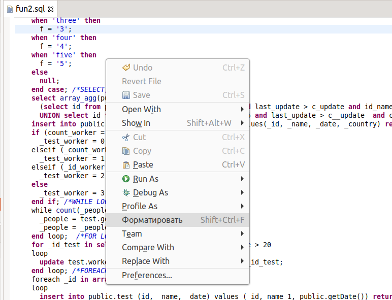

==============
Форматирование
==============

Форматирование автоматически применится к коду после использовании комбинации клавиш Shift+Ctrl+F, или в контекстном меню выбрать пункт **Format / Форматировать**.

