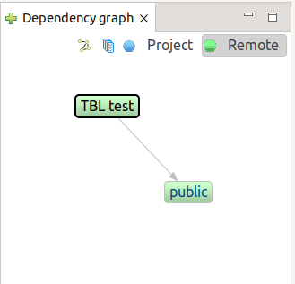
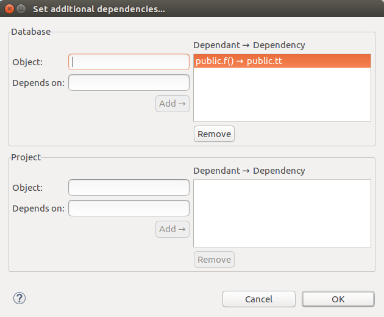
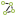
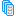
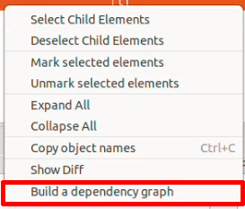
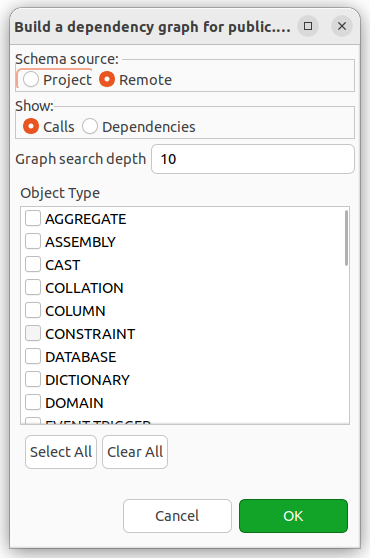
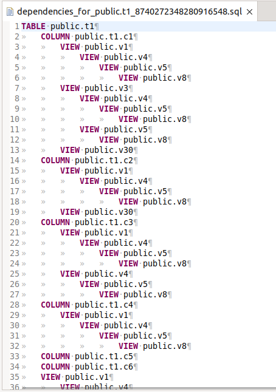

================================
Просмотр зависимостей объекта БД
================================

Панель Граф зависимостей
~~~~~~~~~~~~~~~~~~~~~~~~~

Панель **Dependency graph / Граф зависимостей** показывает зависимости, в которых участвует текущий объект, выбранный в панели различий активного редактора проекта.

Стрелки указывают на направление связи от зависящего объекта к его зависимости.

Переключатель **Project - Remote / Проект - БД** позволяет выбрать, для какой БД, участвующей в сравнении, показывать объекты и зависимости. После переключения необходимо повторно выбрать элемент в панели различий редактора.

Кнопка |show_col| **Show columns / Показать колонки** позволяет отобразить колонки таблиц текущего объекта и его зависимостей.

Кнопка |add_dep| **Add depcy / Добавить зависимости** позволяет открыть диалог ручного добавления зависимостей.

В этом диалоге можно явно задать зависимости между объектами БД. Это может понадобиться, например, в случае если автоматическое распознавание зависимостей не сработает для некоторой сложной зависимости. Добавленные зависимости будут учтены при генерации последовательности выражений скрипта наката.

Окно состоит из двух частей, которые служат для добавления зависимостей к сравниваемым БД.

Для добавления зависимостей между объектами, достаточно ввести начальные буквы из названия объекта и из выпадающего списка выбрать имена зависимых объектов и нажать на кнопку **Add / Добавить**. Зависимость отобразится в списке добавленных.

Для удаления выделите связку зависимых объектов и нажмите **Remove / Удалить**.

.. _overrideView :

Построение графа зависимостей
~~~~~~~~~~~~~~~~~~~~~~~~~~~~~

В редакторе сравнения предусмотрена возможность построения графа зависимостей для выбранного объекта. Чтобы построить граф, щёлкните правой кнопкой мыши по интересующему объекту и выберите пункт контекстного меню **Build a dependency graph / Построить граф** зависимостей.

После этого укажите параметры построения:

Schema source / Источник схемы — выберите источник, в котором будет выполняться поиск зависимостей.

**Show / Показать** — укажите, что именно отображать: зависимости объекта (**Dependencies / Зависимости**) или объекты, из которых вызывается выбранный объект (**Calls / Вызовы**).

**Graph search depth / Глубина поиска** — задайте необходимую глубину поиска (количество учитываемых объектов).

**Object type / Тип объекта** — выберите типы объектов базы данных, которые следует включить в результат. По умолчанию отображаются зависимости всех типов.

После выполнения настроек будет построен и отображён граф зависимостей для указанного объекта.

