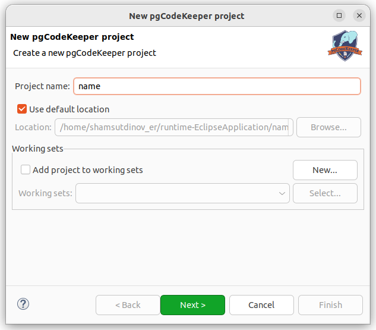
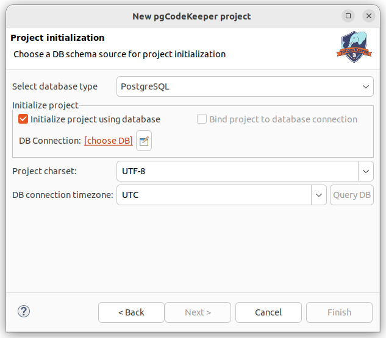

=======================
Создание нового проекта
=======================

- Открываем мастер создания нового проекта: **File -> New -> pgCodeKeeper Project**
- Указываем имя проекта.
- При необходимости изменяем местоположение и рабочую область проекта.
- Нажимаем кнопку **Next**.

- Выбираем тип базы данных **Select database type / Выберите тип базы данных** PostgreSQL(для PostgreSQL и Greenplum), MS SQL или ClickHouse
- Выбираем источник базы данных или отключаем параметр **Initialize project using database / Инициализировать проект базой данных**.
- Выбираем параметр **Bind project to database connection / Привязать проект к подключению к БД**, если хотим работать только с одной базой данных.
- Выбираем кодировку проекта.
- Выбираем временную зону подключения к БД (имеется возможность получить из текущей БД). Данный шаг не доступен для проектов MS SQL.
- Нажимаем кнопку **Finish**.

После короткого ожидания получаем новый проект и будет автоматически открыт :ref:`projEditor`.