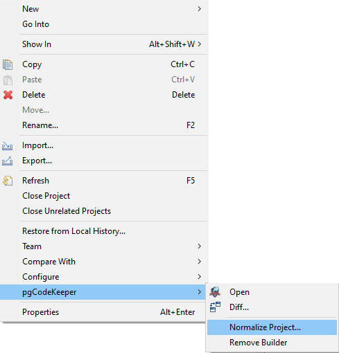
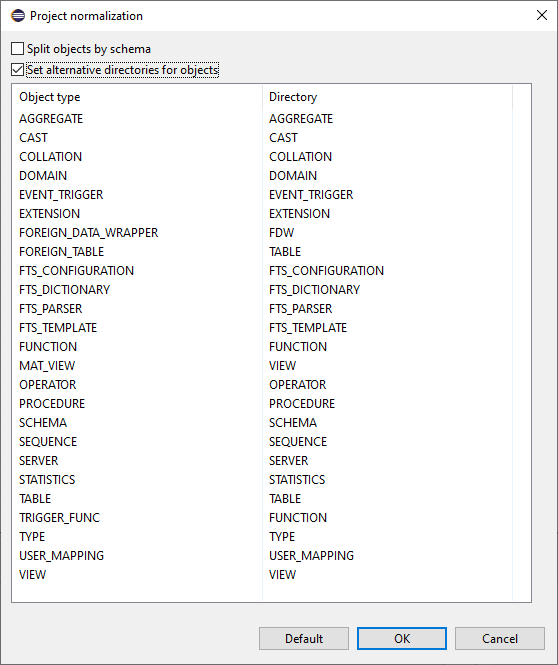

====================
Нормализация проекта
====================

Для восстановления или изменения структуры можно воспользоваться нормализацией проекта. Для этого из меню проекта выберите пункт **pgCodeKeeper -> Normalize Project... / Нормализовать проект...**

В открывшемся диалоговом окне можно изменить настройку группировки объектов по схемам, а также изменить соответствие типа объекта и его директории.

После нажатия кнопки **OK** структура проекта будет изменена в соответствии с заданными настройками.
