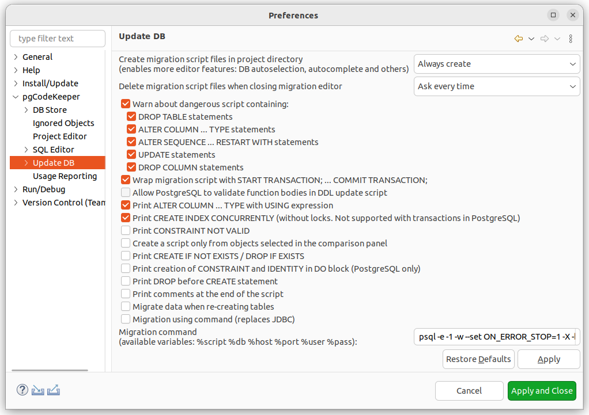
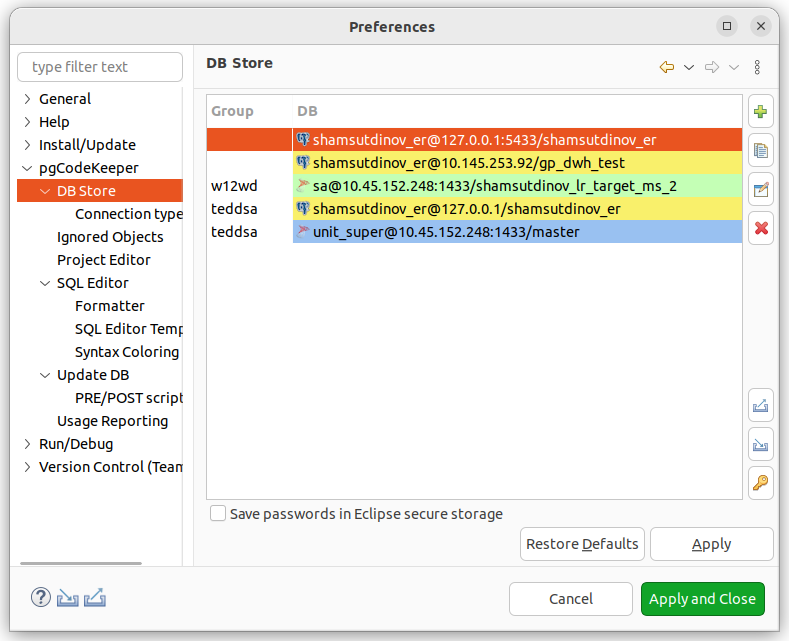
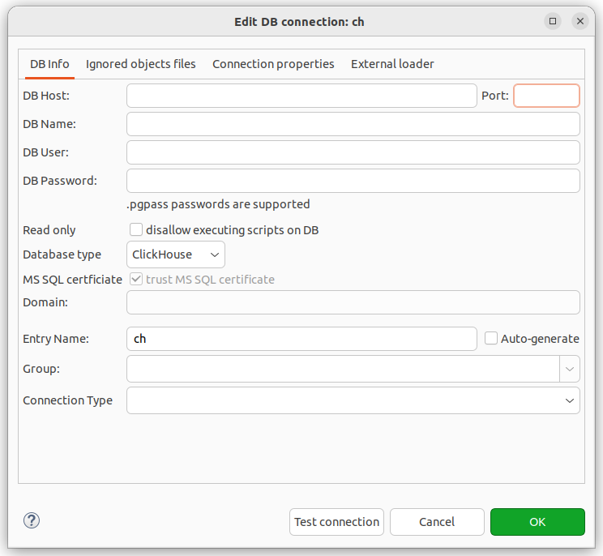

====================
Глобальные настройки
====================

Основные настройки pgCodeKeeper
~~~~~~~~~~~~~~~~~~~~~~~~~~~~~~~

- **Show console on new output / Показывать консоль** - позволяет автоматически показывать консоль программы при выводе в нее.
- **Ignore privileges and owners of database objects / Не учитывать привилегии и владельцев объектов** - позволяет отключить поиск различий в свойствах объектов, связанных с ролями БД.
- **Ignore differences in table column order / Игнорировать различия в порядке столбцов таблицы** - позволяет не учитывать порядок столбцов при сравнении таблиц.
- **Reuse compare editor instead of opening new ones / Использовать открытый редактор сравнения вместо создания новых** - позволяет использовать открытый редактор сравнения при сравнения объектов базы данных (В контекстном меню таблицы различий выбрать пункт **Show Diff / Показать различия**).
- **Enable full dependencies from bodies of functions and procedures (experimental) / Учитывать все зависимости из тел функций и процедур (экспериментально)** - позволяет искать внутри тел функций и процедур зависимости к другим функциям и процедурам.
- **Simple formatting for VIEWs when reading via JDBC (not recommended by PostgreSQL) / Упрощенное форматирование представлений при чтении через JDBC (не рекомендовано PostgreSQL)** - позволяет использовать упрощенное форматирование представлений, убирая лишние скобки в выражениях. Данный формат может не поддерживаться в будущих версиях PostgeSQL.
- **Ignore concurrent modification errors when reading DB / Игнорировать ошибки конкурентной модификации объектов при чтении БД** - позволяет игнорировать ошибки, возникающие при модификации объекта БД во время его чтения.
- **Format object code automatically / Форматировать код объектов автоматически** - позволяет отображать и сохранять отформатированный код объектов согласно настройкам форматирования **SQL Editor/Редактор SQL**. Подробнее про настройки форматирования кода в :ref:`format`.
- **Number of parser threads / Количество потоков парсера** — настройка, позволяющая оптимизировать использование ресурсов процессора (ЦПУ). При уменьшении числа потоков парсер будет использовать меньше ресурсов ЦПУ.
- **Free parser cache memory if not used for (minutes): / Освобождать память кэша парсера если он не использовался последние (минут):** - позволяет автоматически очищать неиспользуемый кэш парсера через определенный промежуток времени. Значение равное 0 отключает данное поведение.
- **Clear parser cache / Очистить кэш парсера** - позволяет очистить кэш парсера.

.. _ignoredObjects :

Исключенные объекты
~~~~~~~~~~~~~~~~~~~

Объекты, которые не должны учитываться при сравнении БД, возможно указать на странице настроек **pgCodeKeeper -> Ignored Objects / Исключенные объекты**.

Переключатель **Черный список** - **Белый список** позволяет инвертировать черный список в белый и обратно.

Для добавления объекта в список исключенных, редактирования или удаления из него, служат кнопки |add_obj|, |edit_obj| и |delete| соответственно.

При добавлении и редактировании объекта откроется окно, в котором вы сможете выбрать необходимые настройки для исключенного объекта.

Настройки исключенного объекта
------------------------------

- **Pattern / Шаблон** – воспринимать имя объекта как регулярное выражение.
- **Apply to contents / Применить к содержимому** – применять правило для совпавшего объекта и всего его содержимого.
- **Qualification / Квалификация** – искать объекты по квалифицированному имени.
- **Type / Тип** – тип объекта. Если ни один объект не выбран, настройки применятся к любому объекту.

Выбранные настройки будут отображены в главном окне "Исключенные объекты" рядом с именем объекта.

.. note:: В данном случае список исключаемых объектов будет **общим** и будет распространять свое действие на все проекты находящиеся в директории проектов. Подробное описание работы со списками находится в разделе :ref:`ignoreList`.

.. _dbUpdate :

Обновление БД
~~~~~~~~~~~~~
Настройки, управляющие обновлением базы данных.

На странице настроек **pgCodeKeeper -> Update DB / Обновление БД** Вы можете настроить параметры для работы редактора скрипта наката.

- **Create migration script files in project directory / Создавать скрипт миграции в директории проекта** – определяет поведение при создании скриптов миграции. 
- **Delete migration script files when closing migration editor / Удалять файлы скриптов миграции после закрытия редактора** – определяет поведение при закрытии скриптов миграции, если они были созданы в директории проекта.
- **Warn about dangerous scripts containing: / Предупреждать, если в скрипте присутствуют следующие выражения:** – позволяет предупреждать, если при генерации скрипта образовались выбранные опасные выражения.
- **Show script output in separate window / Показывать вывод скрипт наката в отдельном окне** – позволяет просмотреть сообщение с ответом сервера при выполнении наката.
- **Surround migration script with START TRANSACTION; ... COMMIT TRANSACTION; / Заключить скрипт наката в блок START TRANSACTION; ... COMMIT TRANSACTION;** – позволяет дополнять генерируемые скрипты парой start ... commit.
- **Allow PostgreSQL to validate function bodies in DDL update script / Разрешить PostgreSQL проверять тела функций в скрипте наката** – позволяет при генерации скрипта добавлять проверку ``SET check_function_bodies = true;`` в начало скрипта.
- **Print ALTER COLUMN ... TYPE with USING expression / Печатать ALTER COLUMN ... TYPE ... с USING expression** – позволяет добавлять в скрипт выражение, позволяющее изменить тип данных, при изменении типа столбца
- **Print CREATE INDEX CONCURRENTLY (without locks. Not supported with transactions in PostgreSQL) / Печатать CREATE INDEX CONCURRENTLY (без блокировок. Не поддерживается вместе с транзакциями в PostgreSQL)** – позволяет в скриптах создавать индексы в режиме CONCURRENTLY.
- **Print CONSTRAINT NOT VALID / Печатать CONSTRAINT NOT VALID** - позволяет добавлять в скрипт миграции конструкцию ``NOT VALID`` для констрейнтов.
- **Print CREATE IF NOT EXISTS/DROP IF EXISTS / Печатать CREATE IF NOT EXISTS/DROP IF EXISTS** – позволяет добавить конструкцию ``IF NOT EXISTS/IF EXISTS`` в скрипте миграции в конструкции CREATE / DROP объекта.
- **Print creation of CONSTRAINT and IDENTITY in DO block (PostgreSQL only) / Печатать создание CONSTRAINT и IDENTITY в DO блоке (только для PostgreSQL)** - позволяет обернуть создание CONSTARAINT и IDENTITY в блок DO (только для PostgreSQL)
- **Print DROP before CREATE statement / Печатать DROP перед CREATE конструкцией** – позволяет добавить конструкцию DROP перед CREATE конструкцией в скрипте миграции.
- **Create a script only from objects selected in the comparison panel / Создавать скрипт только из объектов, выбранных в панели сравнения** – позволяет исключить из скрипта объекты, которые не были выбраны явно.
- **Print comments at the end of the script / Печатать комментарии в конце скрипта** - переносит добавление всех комментариев в конец скрипта миграции.
- **Migrate data when re-creating tables / Мигрировать данные при пересоздании таблиц** - позволяет сохранить данные при пересоздании таблицы. При пересоздании существующая таблица переименовывается и создается новая, данные из исходной переливаются в новую. Старая переименованная таблица удаляется. Состояние IDENTITY SEQUENCE переносится из старой таблицы в новую. Обычные SEQUENCE не поддерживаются.
- **Migration command / Команда миграции** - позволяет использовать другую утилиту или параметры запуска при применении скрипта наката к базе данных.

Во вкладке **Update DB / Обновление БД -> PRE/POST script** есть настройки для добавления PRE/POST скриптов для миграций. В проекте возможно создать директории PRE и POST, содержимое которых будет добавлено в начало и конец основного скрипта. Также доступны PRE/POST скрипты в глобальных настройках и в опциях CLI.
Для редактирования содержимого скриптов PRE/POST выберите соответствующие кнопки.

Отчеты об использовании
~~~~~~~~~~~~~~~~~~~~~~~

Настройки, управляющие отправкой отчетов.

.. image:: ../images/report.png

На странице настроек **pgCodeKeeper -> Usage Reporting / Отчеты об использовании** Вы можете включить или выключить отправление статистики об использовании pgCodeKeeper.

Отправляемые значения для статистики Вы можете просмотреть в поле **Reported Values / Отправляемые значения**.

.. _projEditorPref :

Редактор проекта
~~~~~~~~~~~~~~~~

Настройки, управляющие редактором проекта.

На странице настроек **pgCodeKeeper -> Project editor / Редактор проекта** Вы можете настроить параметры редактора проекта.

- **Switch to pgCodeKeeper perspective when opening editor / Переключать в перспективу pgCodeKeeper при открытии редактора** – определяет поведение переключения перспективы при открытии редактора проекта. 
- **After applying a migration to editor's DB do: / После выполнения миграции на БД редактора выполнить:** – определяет поведение редактора при накате скриптов миграции.
- **Display git user that math the change / Отображать пользователя git, совершившего изменение** – позволяет отображать в редакторе колонку с пользователем git, совершившем последнее изменение файла. Проект должен находиться под системой контроля версий.
- **Show errors while getting changes / Показывать ошибки во время получения изменений** – позволяет отображать список ошибок, найденных во время получения изменений.
- **Show code of all child objects when comparing / Показывать код всех дочерних объектов при сравнении** - позволяет отображать в панели сравнения код всех дочерних объектов даже если в них нет различий.

Редактор SQL 
~~~~~~~~~~~~

Настройки, управляющие редактором SQL.

.. image:: ../images/sql_editor_prefs.png

На странице настроек **pgCodeKeeper -> SQL Editor / Редактор SQL** Вы можете настроить параметры редактора SQL.

- **Disable parser for files larger than (lines): / Отключить парсер для файлов больше чем (строки):** – позволяет выбрать размер файла, для которого отключается сборщик pgCodeKeeper. Это ускоряет открытие и работу с файлом, но отключает поиск ошибок и ссылок на объекты внутри этого файла. Значение равное 0 отключает данное поведение.
- **Bracket highlight / Подсветка скобок** – включает подсветку скобок в одном из режимов.
- **Single bracket / Одна скобка** – при выборе скобки, подсвечивает парную скобку.
- **Both brackets / Обе скобки** – при выборе скобки, подсвечивает текущую и парную скобку.
- **Current block brackets / Скобки текущего блока** – подсвечивает скобки, между которыми находится курсор.
- **Bracket highlight color / Цвет подсветки скобок** – позволяет выбрать цвет подсветки скобок.

.. _format :

Форматирование
~~~~~~~~~~~~~~~

Настройки для управления правилами форматирования.

На странице настроек **pgCodeKeeper -> SQL Editor / Редактор SQL -> Formatting / Форматирование** можно установить:

- тип отступа, применяемый в начале строки кода;
- задать ширину отступа для выбранного типа отступа;
- включить/отключить настройку удаления пробелов в конце строки;
- добавление пробелов перед/после операторов.

Подсветка синтаксиса
~~~~~~~~~~~~~~~~~~~~

Настройки, управляющие подсветкой синтаксиса.

На странице настроек **pgCodeKeeper -> SQL Editor / Редактор SQL -> Syntax Coloring / Подсветка синтаксиса** Вы можете установить цвет и стиль шрифта, которым будет отображаться соответствующий синтаксис в SQL редакторе pgCodeKeeper.

Шаблоны редактора SQL
~~~~~~~~~~~~~~~~~~~~~

Создание, удаление и редактирование шаблонов для автоподстановки в SQL редакторе

.. image:: ../images/sql_templates.png

На странице настроек **pgCodeKeeper -> SQL Editor / Редактор SQL -> SQL Editor Templates / Шаблоны редактора SQL** Вы можете управлять SQL шаблонами для объектов базы данных PostgreSQL, MS SQL и ClickHouse, доступными в SQL редакторе pgCodeKeeper. Список доступных действий отображается справа от списка шаблонов.

.. _dbStore :

Хранилище БД
~~~~~~~~~~~~
Настройки, управляющие хранилищем параметров подключения к БД.

На странице настроек **pgCodeKeeper -> DB Store / Хранилище БД** находится список записей для подключения к базам данных.
Для загрузки списка подключений из файла нажмите по кнопке |import_db| **Import connection list / Импортировать список подключений** и выберите необходимый файл с подключениями. Также вы можете сохранить список подключений в отдельный файл, для этого нажмите по кнопке |export_db| **Export connection list / Экспортировать список подключений**.

Для добавления хранилища нажать кнопку |add_obj|. Откроется диалог **DB credentials** (Данные подключения к БД), в котором нужно указать параметры данных подключения: хост, порт, имя БД, пользователь, пароль, группа БД, тип соединения, а также включить запрет на запись в БД и выбрать тип БД PostgreSQL (для PostgreSQL или Greenplum), MS SQL или ClickHouse. Для MS SQL можно указать домен. Если выбран тип бд MS SQL, то по умолчанию выставлен параметр **trust MS SQL сertificate / доверять сертификату MS SQL**, который можно отключить. Название записи можно указать вручную, для этого нужно отключить опцию **Auto-generate / Автогенерация**.

.. note:: pgCodeKeeper поддерживает работу с `pgpass файлом <https://www.postgresql.org/docs/current/libpq-pgpass.html>`_. Для этого поле с паролем нужно оставить пустым.

:ref:`ignoreList` можно подключить как внешний файл.

.. image:: ../images/new_connection_ignore_list.png

| Свойства соединения можно дополнить параметрами указанными по адресу:
| https://jdbc.postgresql.org/documentation/head/connect.html (Для PostgreSQL и Greenplum)
| https://docs.microsoft.com/sql/connect/jdbc/setting-the-connection-properties (Для MS SQL)
| https://clickhouse.com/docs/en/integrations/java#jdbc-driver (Для ClickHouse)

- **Use external DB loader instead of JDBC / Использовать внешний загрузчик pg_dump** - позволяет использовать внешний загрузчик для базы данных вместо JDBC.
- **Loader executable / Исполняемый файл загрузчика** - путь к утилите, исполняемому файлу или скрипту, используемый для загрузки.
- **Loader custom parameters / Дополнительные параметры загрузчика** - дополнительные параметры вызова утилиты.

.. image:: ../images/new_connection_pg_dump.png

Для добавления хранилища на основе данных из уже созданного хранилища следует выделить объект хранилища баз данных, нажать кнопку |copy|. Откроется диалог **DB credentials / Данные подключения к БД** в котором можно изменить параметры подключения.

Для добавления хранилища на основе данных из файла **.pgpass**, нажать кнопку |pg_pass|. Откроется диалог в котором необходимо выбрать **.pgpass** файл. Далее откроется диалог  **Pgpass sources list / Список источников из pgpass**:

В нем нужно выбрать строку с данными на основе которых будет создаваться хранилище. Откроется диалог **DB credentials / Данные подключения к БД** в котором можно подтвердить параметры подключения.

После этого можно закрывать диалог **Pgpass sources list / Список источников из pgpass**.

Для редактирования хранилища выделить объект хранилища баз данных, нажать кнопку |editor_area|. Откроется диалог **DB credentials / Данные подключения к БД** в котором можно изменить параметры подключения.

Для удаления хранилища выбрать необходимую запись и нажать кнопку |delete|.

.. attention:: Кнопка **Restore Defaults**, на странице настроек, удаляет все записи для подключения к базам данных и создает одну запись default без данных для подключения.

.. attention:: Для сохранения внесенных изменений, в хранилище параметров подключения к БД, на странице настроек необходимо нажать кнопку **Apply** или **Apply and Close**.

Тип соединения
~~~~~~~~~~~~~~
Настройки управляющие типом соединения.

На странице настроек **pgCodeKeeper -> DB Store / Хранилище БД -> Connection type / Тип соединения** находится список типов соединения.

.. image:: .. /images/connection_type.png

Для загрузки списка из файла нажмите по кнопке |import_db| **Import / Импортировать** и выберите необходимый файл. Также вы можете сохранить список в отдельный файл, для этого нажмите по кнопке |export_db| **Export / Экспортировать**. Для добавления типа соединения нажмите по кнопке |add_obj|. Откроется диалог **Create new connection type**

.. image:: .. /images/create_new_connection_type.png

- **Name / Имя** - имя типа соединения, отображаемое в списке и в выпадающем меню диалогового окна **DB credentials** **DB Store / Хранилище БД**.
- **Color / Цвет** - цвет, используемый для заливки имени соединения в списке :ref:`dbStore`, в панели инструментов и SQL редакторе

.. image:: ../images/exemple_comdo_con_type.png

.. |copy| image:: ../images/pgcodekeeper_project_view/copy_edit.png
.. |pg_pass| image:: ../images/pgcodekeeper_project_view/pg_pass.png
.. |delete| image:: ../images/pgcodekeeper_project_view/delete_obj.png

.. |edit_obj| image:: ../images/pgcodekeeper_project_view/copy_edit.png
.. |editor_area| image:: ../images/pgcodekeeper_project_view/editor_area.png
.. |import_db| image:: ../images/pgcodekeeper_project_view/import_wiz.png
