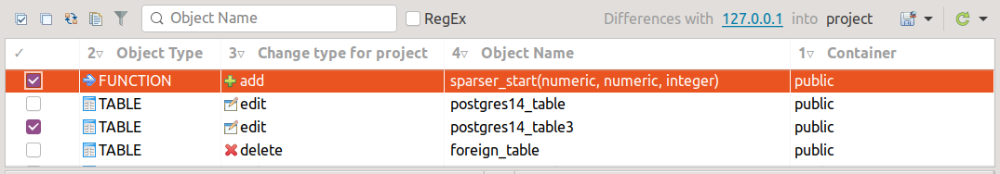

==================
Обновление проекта
==================

На панели инструментов открываем выпадающее меню кнопки **Get Changes / Получить изменения** |refresh| и выбираем источник базы данных, на основании которого будет обновляться проект pgCodeKeeper.

Нажимаем кнопку |refresh|. После недолгого ожидания на панели различий отобразится список различий с указанием типа изменения.

Открываем выпадающее меню кнопки **Применить / Apply** |save_edit| и выбираем |app_icon| **Проект / Project**. Отмечаем флажками необходимые изменения, нажимаем на кнопку |save_edit|, и открывается диалог **Подтвердите обновление проекта / Confirm Project Update**.

.. image:: ../images/update_project_dialog.png

Проверяем список объектов, выбранных пользователем, и список зависимых объектов. Будьте внимательны! Исключение объектов-зависимостей из обновления может привести к ошибкам или неожиданным результатам.

Если вместо изменения самих объектов необходимо сохранить переопределения их свойств (например, привилегии), то выбираем соответствующую опцию. Выполняется только для объектов с типом изменения **edit**.

Для подтверждения применения изменений к проекту нажать кнопку **OK**. В случае успешного применения изменений в **консоли pgCodeKeeper** появится соответствующее сообщение. 

**Обновление файлов проекта приводит к сбросу списка различий.**

.. |refresh| image:: ../images/pgcodekeeper_project_view/refresh.png
   :height: 16px
   :width: 16 px
.. |save_edit| image:: ../images/pgcodekeeper_project_view/save_edit.png
.. |app_icon| image:: ../images/pgcodekeeper_project_view/app_icon16.png

