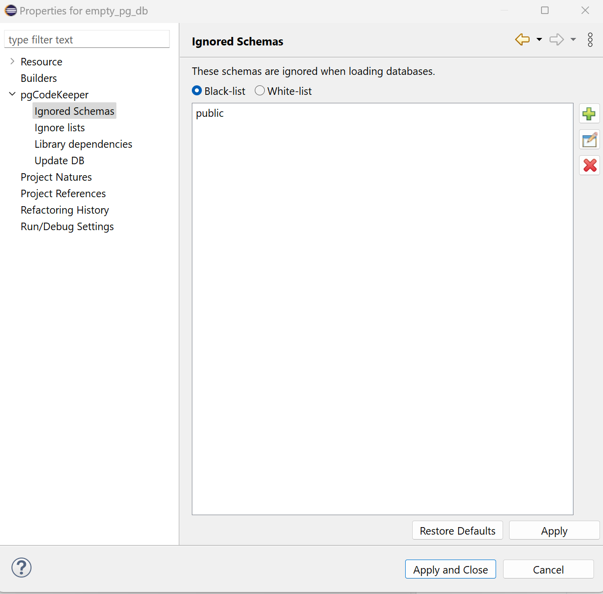
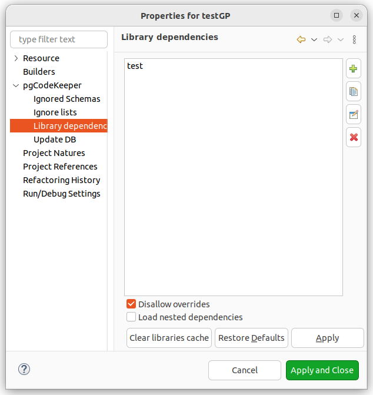
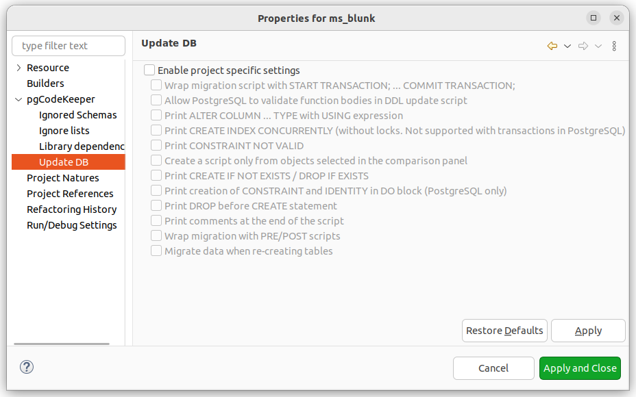

=================
Настройки проекта
=================

Помимо глобальных настроек, применяемых для всего рабочего пространства, существуют возможность настройки отдельного проекта. Для этого из меню проекта выберите пункт **Properties** или нажмите горячую клавишу (по-умолчанию Alt + Enter). Затем выберите пункт **pgCodeKeeper**.

Основные настройки проекта
~~~~~~~~~~~~~~~~~~~~~~~~~~

- **Disable SQL parser for unrelated files opened in SQL Editor / Отключить SQL парсер для сторонних файлов, открытых в SQL редакторе** - позволяет отключить сборщик pgCodeKeeper для файлов проекта, находящихся вне стандартных директорий. Это отключает поиск ошибок и ссылок на объекты внутри этих файлов.

- **Use Unix-style newline characters / Использовать Unix символы переноса строк** - позволяет использовать Unix символы переноса в строках, например в телах функций, комментариях объектов и т.д.

- **Bind project to database connection / Привязать проект к подключению к БД** - позволяет привязать проект к конкретной БД. Для данного проекта станет невозможно изменить БД на **Панель инструментов Eclipse**.

- **Timezone for all DB connections / Временная зона для всех соединений с БД** - позволяет выбрать, какую временную зону использовать при соединении с базами данных. Отсутствует для MS SQL проектов.

- **Enable project specific settings / Переопределить глобальные настройки (только для текущего проекта)** - позволяет переопределить некоторые глобальные настройки для текущего проекта.

  - **Ignore privileges and owners of database objects / Не учитывать привилегии и владельцев объектов** - позволяет отключить поиск различий в свойствах объектов, связанных с ролями БД.

  - **Ignore differences in table column order / Игнорировать различия в порядке столбцов таблицы** - позволяет не учитывать порядок столбцов при сравнении таблиц.

  - **Enable full dependencies from bodies of functions and procedures (experimental) / Учитывать все зависимости из тел функций и процедур (экспериментально)** - позволяет искать внутри тел функций и процедур зависимости к другим функциям и процедурам.

  - **Simple formatting for VIEWs when reading via JDBC (not recommended by PostgreSQL) / Упрощенное форматирование представлений при чтении через JDBC (не рекомендовано PostgreSQL)** - позволяет использовать упрощенное форматирование представлений, убирая лишние скобки в выражениях. Данный формат может не поддерживаться в будущих версиях PostgeSQL.

  - **Format object code automatically / Форматировать код объектов автоматически** - позволяет отображать и сохранять отформатированный код функций на языках plpgsql и sql согласно настройкам форматирования **SQL Editor/Редактор SQL**. Подробнее про настройки форматирования кода в :ref:`format`.

  - **Use global ignore list / Использовать глобальный список игнорирования** - позволяет включить или отключить использование глобального списка различий со страницы настроек :ref:`ignoredObjects`.

Списки исключений
~~~~~~~~~~~~~~~~~

Настройки, управляющие списками игнор файлов для данного проекта. Подробное описание работы со списками находится в разделе :ref:`ignoreList`.

Кнопка **Edit .pgcodekeeperignore / Редактировать .pgcodekeeperignore** позволяет изменить стандартный игнор файл, находящийся в корне проекта.

Для добавления существующего файла нажмите кнопку |add_obj|.

Для удаления файла нажмите кнопку |delete|.

Для создания нового файла нажмите кнопку |new_file|. Будет открыт редактор списка правил, аналогичный редактору на странице глобальных настроек :ref:`ignoredObjects`.

Для редактирования файла нажмите кнопку |editor_area|. Будет открыт редактор списка правил из текущего файла.

Исключенные схемы
~~~~~~~~~~~~~~~~~

Настройки, регулирующие загрузку объектов из базы данных. Подробное описание работы находится в разделе :ref:`ignoreSchemaList`.

Для добавления объекта нажмите кнопку |add_obj| - откроется редактор добавления нового объекта.

Для удаления объекта нажмите кнопку |delete|.

Если возникла необходимость изменить название объекта, надо кликнуть по имени объекта и ввести новое имя.

Библиотечные зависимости
~~~~~~~~~~~~~~~~~~~~~~~~

Настройки, управляющие библиотеками проекта. 

**Библиотеки** - это подключаемые наборы данных объектов, которые "*склеиваются*" с объектами проекта при сравнении с удаленной базой данных. В качестве библиотек можно использовать директории (это может быть как другой pgCodeKeeper проект, так и обычная директория с файлами), дампы или же удаленная база данных. Кроме того, библиотеки возможно упаковать в zip-архив, загрузить на сервер, и подключить, указав URL архива.
Для добавления библиотек воспользуйтесь соответствующими кнопками на боковой панели.

Библиотеки загружаются в порядке, в котором они указаны в списке (самая верхняя библиотека будет загружена первой). Для изменения порядка необходимо просто перетащить нужную библиотеку в нужное место.

**Disallow overrides / Запретить переопределение.** Не исключена ситуация, когда проект и библиотека (или две библиотеки) содержат объекты с одинаковыми именами. Существует два варианта обработки таких ситуаций. При включенной настройке, такие конфликты вызывают остановку сравнения объектов. Отключенная настройка позволяет игнорировать конфликты: будет использован первый загруженный объект. Вне зависимости от настройки будет отображен вид :ref:`overrideView`, в котором будут отображены все конфликты.

**Load nested dependencies / Загружать вложенные зависимости** - настройка, позволяющая загружать библиотеки, на которые ссылаются другие библиотеки (рекурсивная загрузка библиотек). Библиотека с зависимостями должна быть в формате проекта (или архива проекта) и содержать файл .dependencies с зависимостями этой библиотеки.

В общем случае, для загрузки зависимостей библиотеки, контейнер этой библиотеки должен иметь включенную настройку *loadNested* в файле *.dependencies*. Например, в цепочке зависимостей *project → lib1 → lib2 → lib3* для загрузки *lib2* настройка должна быть включена в project, а для загрузки *lib3* настройка должна быть включена в project и в *lib1*.

**Clear lidraries cache / Очистить кэш библиотек** - позволяет удалить скачанные архивы из кэша .

Диалоговое окно создание/редактирование/копирование библиотечной зависимости выглядит следующим образом.

- **Name / Имя** данная библиотека будет отображаться в списке под этим именем, если это поле опущено, то вместо имени будет использован **Path / Путь**.
- **Path / Путь** в этом поле необходимо указать путь до библиотечной зависимости (поддерживается как абсолютный путь так и относительный).
- **Owner / Владелец** позволяет установить нового владельца для всех объектов библиотеки.
- **Ignore privileges/owners / Игнорировать привилегии/владельцев** позволяет отключить привилегии и владельцев объектов библиотечной зависимости.

.. important:: Если у библиотеки заполнен владелец, он будет отображен вне зависимости от прочих настроек pgCodeKeeper.
.. important:: Если у библиотеки не игнорируются привилегии, они будут отображены вне зависимости от прочих настроек pgCodeKeeper.

Обновление БД
~~~~~~~~~~~~~

Настройки, управляющие обновлением базы данных, которые позволяют переопределить некоторые соответствующие настройки со страницы :ref:`dbUpdate`.

.. |add_obj| image:: ../images/pgcodekeeper_project_view/add_obj.png

