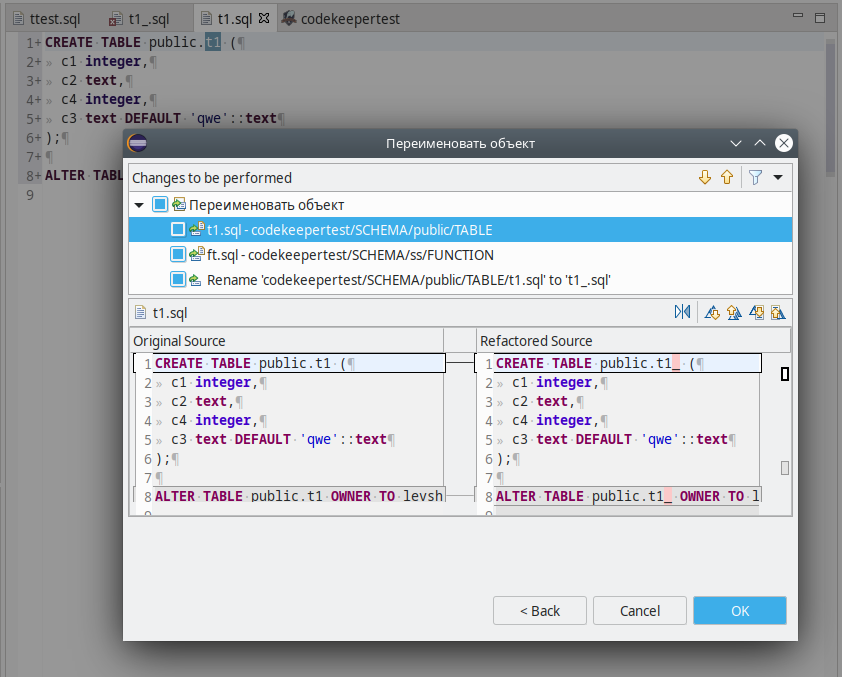
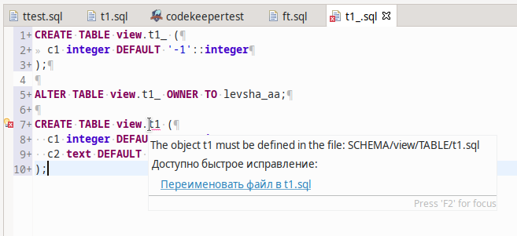

===========
Рефакторинг
===========

В pgCodeKeeper реализована возможность рефакторинга SQL кода. Объекты в SQL коде можно переименовывать вместе со ссылками на них. Чтобы переименовать объекты  выберите в контекстном меню редактора SQL пункт **Переименовать / Rename**  или нажмите горячую клавишу Alt+Shift+R.

Быстрые исправления
~~~~~~~~~~~~~~~~~~~~

Также в pgCodeKeeperе есть возможность быстрого исправления ошибок некорректного расположения объектов. Для того, чтобы исправить эту ошибку, наведите курсор мыши на ошибку (в имени файла) и во всплывающей подсказке или в контекстном меню Quick Fix редактора SQL выберите пункт **Переименовать файл / Rename file**. Файл объекта будет перемещен на ожидаемое для него место в проекте.

