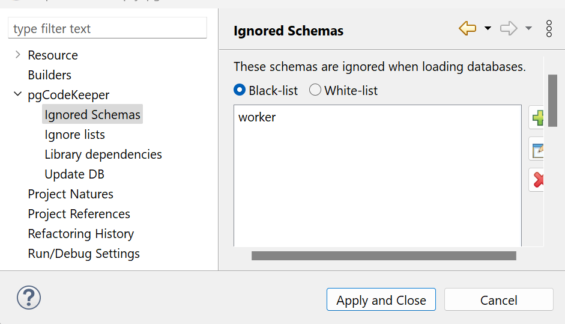
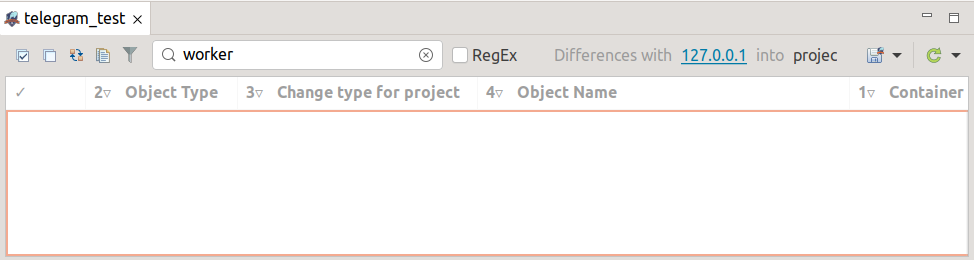

.. _ignoreSchemaList :

=============================
Исключение схем при загрузке
=============================
В pgCodeKeeper реализована возможность выборочной загрузки объектов из базы данных. Для того, чтобы загрузить содержимое определенных схем, их нужно указать в списке исключаемых схем.

Список исключаемых схем - это список схем с их содержимым, которые не должны или наоборот должны загружаться с БД.

Существует два типа списков исключаемых схем:

черный список
        разрешает отображение всех объектов, кроме объектов из указанных схем и самой схемы в правилах списка;

белый список
        работает противоположно черному, запрещает отображение всех объектов, кроме объектов из указанных схем  и самой схемы  в правилах списка.

В каждом проекте можно создать **список исключаемых схем**, распространяющий свое действие только на данный проект, для этого в корне проекта необходимо создать файл **.pgcodekeeperignoreschema** и заполнить его правилами согласно синтаксису списков.

.. attention:: Формат файла **.pgcodekeeperignoreschema** чувствителен к регистру. Кодировка должна быть – UTF-8.

Для файла **.pgcodekeeperignoreschema** действуют те же правила заполнения, что и для :ref:`ignoreList` (смотри раздел :ref:`listSyntax`). 

Мы можем применить список исключаемых схем и в :ref:`dbStore`.
В :ref:`cliVersion` pgCodeKeeper эта опция прописывается так : ``pgcodekeeper-cli --ignore-schema <path> SOURCE DEST``.

Выбор объектов
~~~~~~~~~~~~~~~

При выборе флага Pattern(REGEX) в окне создания нового правила поиск объекта будет производится по регулярному выражению, указанном в поле для имени объекта. 
|ignore-schema|

Пример использования исключения схем при загрузке
~~~~~~~~~~~~~~~~~~~~~~~~~~~~~~~~~~~~~~~~~~~~~~~~~~~

Например, нам понадобилось загрузить все объекты из базы данных, кроме объектов из схемы worker. Добавляем в список исключаемых схем worker, выбираем флаг Black-list / Черный список  в интерфейсе исключаемых схем:

|black_list_2|

Нажимаем Apply and Close.

В редакторе проекта  кликаем по **Changes / Получить изменения** |refresh|. На панели различий нет объектов из схемы worker! 

|black_list_worker|

Если нам необходимо загрузить только объекты из схемы worker, то в интерфейсе исключаемых схем выбираем флаг White-list / Белый список.
В результате на панели различий мы получим объекты только из схемы worker.

|white_list_worker|

